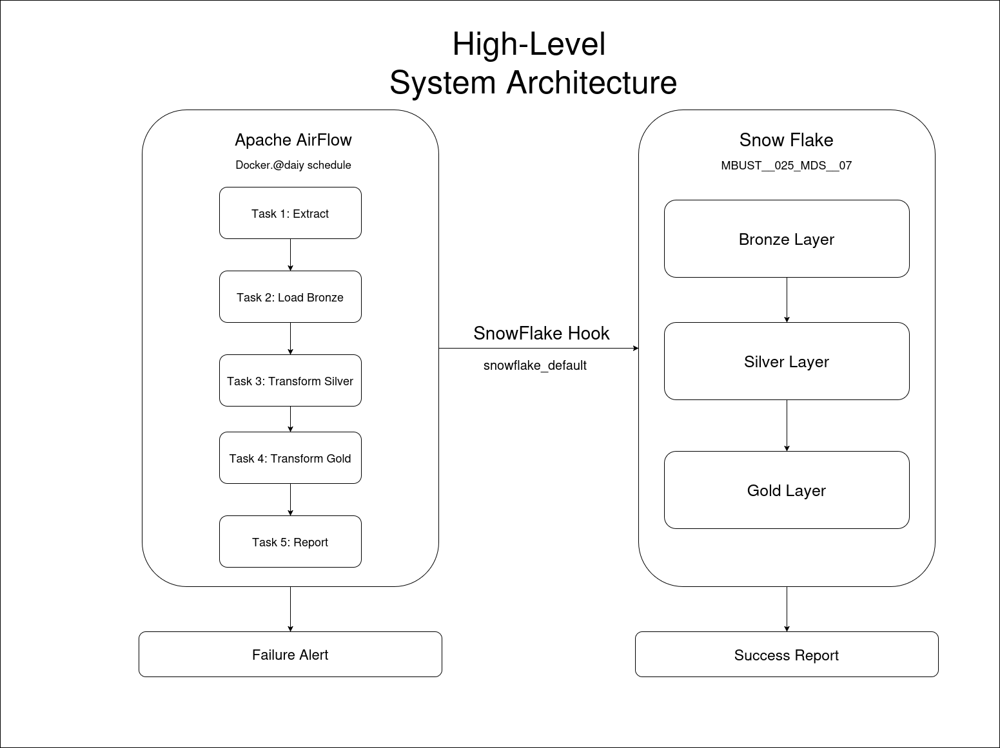
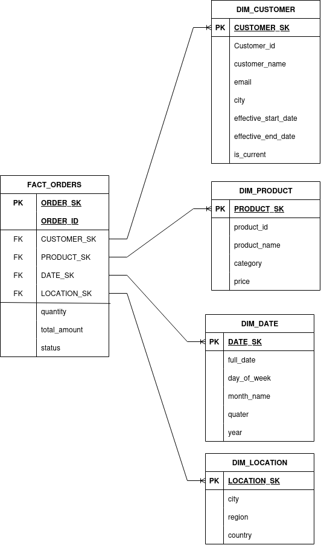

<div align="center">

# 🏔️ Capstone ETL Pipeline
### Medallion Architecture · Apache Airflow · Snowflake


**Student Roll:** `MBUST__025_MDS__07` · **Snowflake DB:** `MBUST__025_MDS__07` · **Warehouse:** `COMPUTE_WH`

</div>

---

## 📋 Table of Contents

1. [Project Overview](#-project-overview)
2. [System Architecture](#-system-architecture)
3. [Pipeline DAG](#-pipeline-dag)
4. [Medallion Layers](#-medallion-layers)
5. [Star Schema — ER Diagram](#-star-schema--er-diagram)
6. [Data Dictionary](#-data-dictionary)
7. [Setup Guide](#-setup-guide)
8. [Observability & Reporting](#-observability--reporting)
9. [Snowflake Data Share](#-snowflake-data-share)
10. [Troubleshooting](#-troubleshooting)

---

## 🎯 Project Overview

An end-to-end Data Engineering pipeline implementing the **Medallion Architecture** (Bronze → Silver → Gold) using **Apache Airflow** for orchestration and **Snowflake** as the cloud data warehouse.

| Layer | Schema | Description |
|---|---|---|
| **Bronze** | `BRONZE` | Raw ingestion — data stored as Snowflake `VARIANT` JSON |
| **Silver** | `SILVER` | Cleaned, typed, deduplicated staging tables |
| **Gold** | `GOLD` | Star Schema — Fact + Dimension tables for analytics |

**Data generated:** 300 customers · 50 products · 1,000 orders (via Python Faker)

---

## 🏗️ System Architecture

> High-level flow from Airflow to Snowflake.



| Component | Technology | Role |
|---|---|---|
| Data Source | Python Faker | Generates synthetic CSV data daily |
| Orchestration | Apache Airflow (Docker) | Schedules and runs the 5-task DAG |
| Connection | `SnowflakeHook` | Airflow → Snowflake via `snowflake_default` |
| Bronze Layer | Snowflake `VARIANT` | Raw JSON — schema-agnostic ingestion |
| Silver Layer | Snowflake typed tables | Cleaned, cast, deduplicated |
| Gold Layer | Snowflake Star Schema | Analytics-ready with SCD Type 2 |
| Failure Alert | Airflow → Gmail SMTP | Immediate email on any task failure |
| Success Report | Snowflake Alert → `SYSTEM$SEND_EMAIL` | Daily summary to stakeholder |
| Data Share | Snowflake Secure Share | Gold layer shared with instructor |

---

## 🔄 Pipeline DAG

**5 tasks run in strict sequence every day:**

```
extract_csv_data
      │
      ▼
load_to_bronze
      │
      ▼
transform_to_silver
      │
      ▼
transform_to_gold
      │
      ▼
send_daily_summary_report
```

| Task | File | What it does |
|---|---|---|
| `extract_csv_data` | `tasks/extract.py` | Generates 300 customers, 50 products, 1000 orders as CSVs using Faker |
| `load_to_bronze` | `tasks/load_bronze.py` | Reads CSVs → uploads to Snowflake Bronze as `VARIANT` JSON via temp table |
| `transform_to_silver` | `tasks/transform_silver.py` | Extracts `VARIANT` fields → typed, cleaned Silver tables |
| `transform_to_gold` | `tasks/transform_gold.py` | Builds Star Schema — DIM tables + FACT_ORDERS + SCD Type 2 |
| `send_daily_summary_report` | `tasks/success_report.py` | Queries Gold → writes `PIPELINE_SUMMARY` → fires Snowflake Alert |

---

## 🥉🥈🥇 Medallion Layers

### Bronze — Raw Ingestion
- Data stored as Snowflake `VARIANT` (schema-agnostic JSON)
- No transformation — exact copy of source CSV
- Uses temp table workaround: `executemany()` inserts plain strings → `SELECT PARSE_JSON()` converts to VARIANT
- Tables: `RAW_CUSTOMERS` · `RAW_PRODUCTS` · `RAW_ORDERS`

### Silver — Cleaned & Typed
- `PARSE_JSON()` extracts individual fields from VARIANT
- Columns are cast to correct types (`DATE`, `FLOAT`, `NUMBER`, `VARCHAR`)
- Deduplication applied
- Tables: `STG_CUSTOMERS` · `STG_PRODUCTS` · `STG_ORDERS`

### Gold — Star Schema
- Dimensional model with 1 Fact + 4 Dimensions
- SCD Type 2 on `DIM_CUSTOMER` for full history tracking
- All joins use surrogate keys (`_SK` columns)
- Tables: `FACT_ORDERS` · `DIM_CUSTOMER` · `DIM_PRODUCT` · `DIM_DATE` · `DIM_LOCATION`

---

## 📊 Star Schema — ER Diagram

> Visual representation of the Gold layer Star Schema.



### Table Relationships

| Dimension | FK in FACT_ORDERS | Join Condition | Cardinality |
|---|---|---|---|
| `DIM_CUSTOMER` | `CUSTOMER_SK` | `c.customer_id = o.customer_id AND c.is_current = TRUE` | 1 : N |
| `DIM_PRODUCT` | `PRODUCT_SK` | `p.product_sk = o.product_sk` | 1 : N |
| `DIM_DATE` | `DATE_SK` | `d.date_sk = o.date_sk` | 1 : N |
| `DIM_LOCATION` | `LOCATION_SK` | `l.location_sk = o.location_sk` | 1 : N |

### Surrogate Key vs Natural Key

Every dimension uses **two kinds of identifiers**:

| Suffix | Name | Example | Role |
|---|---|---|---|
| `_SK` | Surrogate Key | `CUSTOMER_SK = 204` | System-generated `PK` — used for all joins |
| `_ID` | Natural Key | `CUSTOMER_ID = 'CUST-1042'` | Business reference from source — not a PK |

---

## 📖 Data Dictionary

### FACT_ORDERS — `MBUST__025_MDS__07.GOLD.FACT_ORDERS`

> Central fact table. One row per order. Surrogate key `ORDER_SK` is the PK; `ORDER_ID` is the original business reference from the source system.

| Column | Data Type | Key | Description |
|---|---|---|---|
| `ORDER_SK` | NUMBER | 🔑 PK · AI | Surrogate key — Snowflake AUTOINCREMENT |
| `ORDER_ID` | VARCHAR | | Natural key from source — e.g. `ORD-20240315-001` |
| `CUSTOMER_SK` | NUMBER | 🔗 FK | → `DIM_CUSTOMER.CUSTOMER_SK` (is_current = TRUE) |
| `PRODUCT_SK` | NUMBER | 🔗 FK | → `DIM_PRODUCT.PRODUCT_SK` |
| `DATE_SK` | NUMBER | 🔗 FK | → `DIM_DATE.DATE_SK` (YYYYMMDD format) |
| `LOCATION_SK` | NUMBER | 🔗 FK | → `DIM_LOCATION.LOCATION_SK` |
| `QUANTITY` | NUMBER | | Units purchased |
| `TOTAL_AMOUNT` | FLOAT | | Order value in INR |
| `STATUS` | VARCHAR | | `completed` / `pending` / `cancelled` |

---

### DIM_CUSTOMER — `MBUST__025_MDS__07.GOLD.DIM_CUSTOMER`

> SCD Type 2 — full history of customer changes. When `EMAIL` or `CITY` changes, old row is expired (`IS_CURRENT = FALSE`) and a new row inserted.

| Column | Data Type | Key | Description |
|---|---|---|---|
| `CUSTOMER_SK` | NUMBER | 🔑 PK · AI | Surrogate key — unique per customer version |
| `CUSTOMER_ID` | VARCHAR | NN | Natural key from source system |
| `CUSTOMER_NAME` | VARCHAR | | Full name |
| `EMAIL` | VARCHAR | | Tracked for SCD2 changes |
| `CITY` | VARCHAR | | Tracked for SCD2 changes |
| `EFFECTIVE_START_DATE` | DATE | NN | Date this version became active |
| `EFFECTIVE_END_DATE` | DATE | | `NULL` if currently active |
| `IS_CURRENT` | BOOLEAN | D: TRUE | `TRUE` = latest active version |

---

### DIM_PRODUCT — `MBUST__025_MDS__07.GOLD.DIM_PRODUCT`

> Type 1 — MERGE upsert, latest value only, no history.

| Column | Data Type | Key | Description |
|---|---|---|---|INR
| `PRODUCT_SK` | NUMBER | 🔑 PK · AI | Surrogate key |
| `PRODUCT_ID` | VARCHAR | NN | Natural key from source |
| `PRODUCT_NAME` | VARCHAR | | Display name |
| `CATEGORY` | VARCHAR | | Product category |
| `PRICE` | FLOAT | | Unit price in INR |

---

### DIM_DATE — `MBUST__025_MDS__07.GOLD.DIM_DATE`

> One row per distinct order date. `DATE_SK` uses `YYYYMMDD` integer format — no AUTOINCREMENT.

| Column | Data Type | Key | Description |
|---|---|---|---|
| `DATE_SK` | NUMBER | 🔑 PK | YYYYMMDD integer — e.g. `20240315` |
| `FULL_DATE` | DATE | | Full calendar date |
| `DAY_OF_WEEK` | VARCHAR | | e.g. `Fri` |
| `MONTH_NAME` | VARCHAR | | e.g. `March` |
| `QUARTER` | NUMBER | | 1 – 4 |
| `YEAR` | NUMBER | | e.g. `2024` |

---

### DIM_LOCATION — `MBUST__025_MDS__07.GOLD.DIM_LOCATION`

> Distinct cities from customer data. MERGE inserts new cities on each run.

| Column | Data Type | Key | Description |
|---|---|---|---|
| `LOCATION_SK` | NUMBER | 🔑 PK · AI | Surrogate key |
| `CITY` | VARCHAR | | City name |
| `REGION` | VARCHAR | | Region / state |
| `COUNTRY` | VARCHAR | D: `'INDIA'` | Country — defaults to India |

---

### PIPELINE_SUMMARY — `MBUST__025_MDS__07.GOLD.PIPELINE_SUMMARY`

> Written by Task 5 after every successful run. Read by the Snowflake Alert to generate the daily report email.

| Column | Data Type | Description |
|---|---|---|
| `RUN_DATE` | DATE | Pipeline execution date |
| `TOTAL_ORDERS` | NUMBER | Total orders in FACT_ORDERS |
| `TOTAL_REVENUE` | FLOAT | Sum of TOTAL_AMOUNT (INR) |
| `UNIQUE_CUSTOMERS` | NUMBER | Distinct customer count |
| `UNIQUE_PRODUCTS` | NUMBER | Distinct product count |
| `TOP_CATEGORY` | VARCHAR | Highest revenue category |
| `TOP_CATEGORY_REV` | FLOAT | Revenue of top category |
| `STATUS_BREAKDOWN` | VARCHAR | Orders by status summary |
| `CREATED_AT` | TIMESTAMP | Auto-set to `CURRENT_TIMESTAMP()` |

---

## ⚙️ Setup Guide

### Prerequisites

| Tool | Version | Link |
|---|---|---|
| Docker Desktop | v4.0+ | [docker.com/get-docker](https://docker.com/get-docker) |
| Python | 3.10+ | [python.org](https://python.org) |
| Git | Any | [git-scm.com](https://git-scm.com) |
| Snowflake Account | Free trial or paid | [app.snowflake.com](https://app.snowflake.com) |
| Gmail (2FA enabled) | For SMTP alerts | [myaccount.google.com](https://myaccount.google.com) |

---

### Step 1 — Configure `.env` File

Create `siddhant/.env` — **never commit to Git:**

```env
FERNET_KEY=ZmDfcTF7_60GrrY167zsiPd67pEvs0aGOv2oasOM1Pg=
SMTP_USER=your_gmail@gmail.com
SMTP_PASSWORD=your_16_char_app_password
SNOW_FLAKE_PASS=your_snowflake_password
```

> **Tip:** Generate a fresh Fernet key:
> ```bash
> python -c "from cryptography.fernet import Fernet; print(Fernet.generate_key().decode())"
> ```

---

### Step 2 — Run Snowflake SQL Files

Log in to Snowflake as `ACCOUNTADMIN` and run in order:

```sql
-- 01_setup.sql  → Database · schemas · warehouse
-- 02_bronze.sql → Bronze VARIANT tables
-- 03_silver.sql → Silver typed tables
-- 04_gold.sql   → Gold Star Schema tables
-- 05_alerts.sql → Notification Integration + Daily Alert
-- 06_share.sql  → Secure Share for instructor
```

> ⚠️ Update email addresses in `05_alerts.sql` before running.

---

### Step 3 — Start Airflow

```bash
cd siddhant/
docker compose up airflow-init    # first time only — wait for "=== Init complete! ==="
docker compose up -d              # start all services
```

Open **http://localhost:8080** → `admin` / `admin`

---

### Step 4 — Add Snowflake Connection

**Admin → Connections → snowflake_default → Edit**

| Field | Value |
|---|---|
| Connection Type | `Snowflake` |
| Schema | `BRONZE` |
| Login | `Siddhanr123` |
| Account | `DX38659` |
| Warehouse | `COMPUTE_WH` |
| Database | `MBUST__025_MDS__07` |
| Region | `ap-south-1` |
| Role | `ACCOUNTADMIN` |
| Extra | *(leave completely blank)* |

> ⚠️ Delete everything in the Extra field.

---

### Step 5 — Trigger & Verify

```bash
# Airflow UI → DAGs → capstone_etl_pipeline → Toggle ON → ▶ Trigger DAG
```

Verify in Snowflake:

```sql
SELECT COUNT(*) FROM MBUST__025_MDS__07.BRONZE.RAW_CUSTOMERS;   -- 300
SELECT COUNT(*) FROM MBUST__025_MDS__07.SILVER.STG_ORDERS;       -- 1000
SELECT COUNT(*) FROM MBUST__025_MDS__07.GOLD.FACT_ORDERS;        -- ~1000
SELECT COUNT(*) FROM MBUST__025_MDS__07.GOLD.DIM_CUSTOMER
WHERE  IS_CURRENT = TRUE;                                         -- 300

-- Confirm success report written
SELECT * FROM MBUST__025_MDS__07.GOLD.PIPELINE_SUMMARY
WHERE  RUN_DATE = CURRENT_DATE();
```

---

## 📡 Observability & Reporting

### Failure Alerts
Configured in `default_args` — fires on **any task failure immediately:**

```python
default_args = {
    "email": ["your_email"],
    "email_on_failure": True,
}
```

- **Sent by:** Airflow via Gmail SMTP (port 587, STARTTLS)
- **Content:** DAG name · task name · timestamp · error traceback · link to logs

### Success Report
After all 5 tasks pass, `EXECUTE ALERT` fires `CAPSTONE_DAILY_ALERT`:

- **Sent by:** Snowflake `SYSTEM$SEND_EMAIL` via `capstone_email_integration`
- **Recipients:** Student + Instructor
- **Content:** Total orders · total revenue (INR) · unique customers · top category · status breakdown

| Event | Trigger | Sent by | Recipients |
|---|---|---|---|
| Any task fails | Immediately | Airflow → Gmail | Student only |
| All tasks pass | After Task 5 | Snowflake Alert | Student + Instructor |

---

## 🔗 Snowflake Data Share

Gold layer shared with instructor per submission guidelines:

```sql
ALTER SHARE MBUST__025_MDS__07
    ADD ACCOUNTS = 'your_instructor_snowflake_account';
```

| Item | Value |
|---|---|
| Share Name | `MBUST__025_MDS__07` |
| Instructor Account | `your_instructor_snowflake_account` |
| Tables Shared | All tables in `GOLD` schema |
| Keep active | At least 7 days after deadline |

---

## 🔧 Troubleshooting

| Error | Fix |
|---|---|
| `PermissionError: /opt/airflow/data/` | Fixed in `docker-compose.yml` — `chmod 777` in `airflow-init` |
| `ModuleNotFoundError: No module named 'dags'` | Use `from tasks.xxx import yyy` not `from dags.tasks.xxx` |
| `250001: Could not connect to Snowflake` | Check `Account=QG95357`, `Region=ap-south-1`, Extra field blank |
| `ProgrammingError 002014: PARSE_JSON in VALUES` | Fixed — temp table workaround in `load_bronze.py` |
| `ProgrammingError 002031: Unsupported subquery` | Fixed — `STG_CUSTOMERS` joined directly in `transform_gold.py` |
| `Broken DAG: ImportError cannot import name` | Function name inside `.py` must match the import statement |
| `Port 8080 already in use` | Stop other services on 8080 or change port in `docker-compose.yml` |
| Failure alert email not received | App Password must have no spaces · check Spam folder |

---

<div align="center">

**MBUST__025_MDS__07 · Snowflake · Apache Airflow · Docker**

*Capstone Data Engineering Project*

</div>
